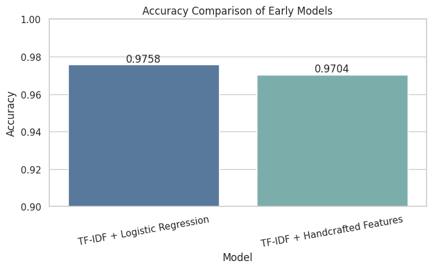
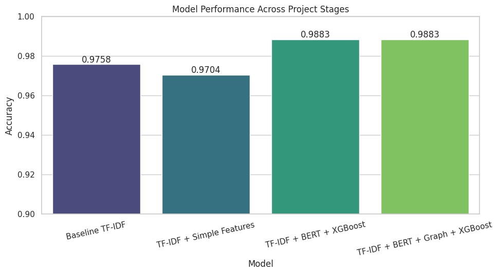
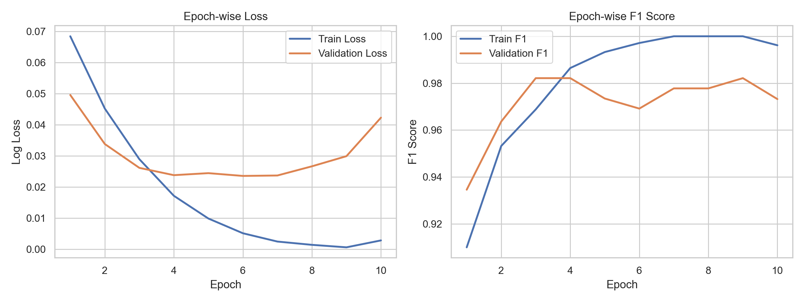
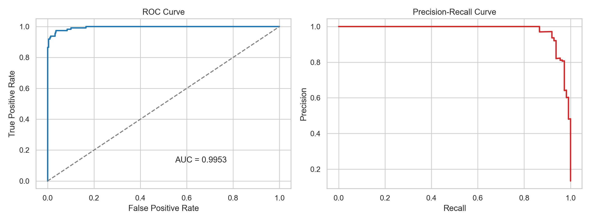
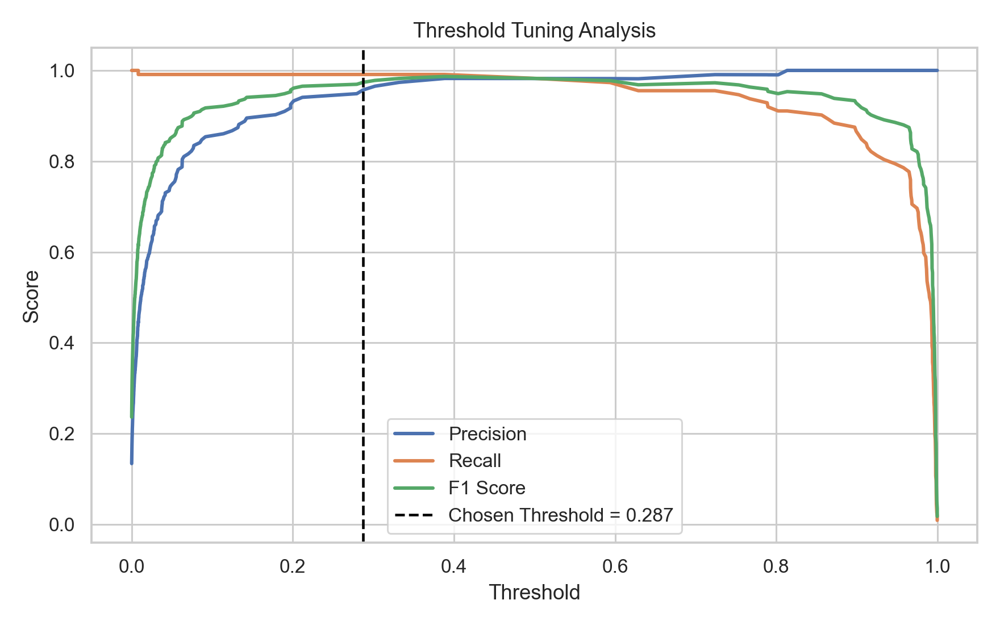
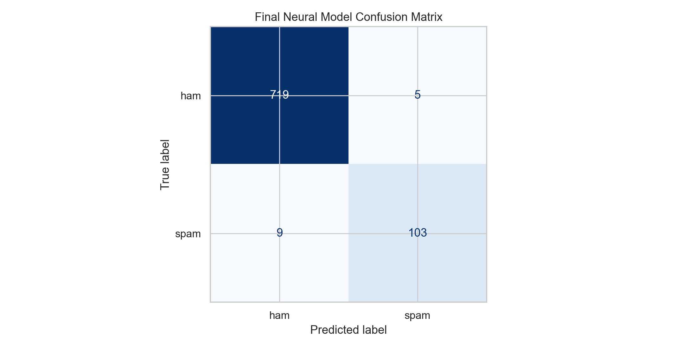
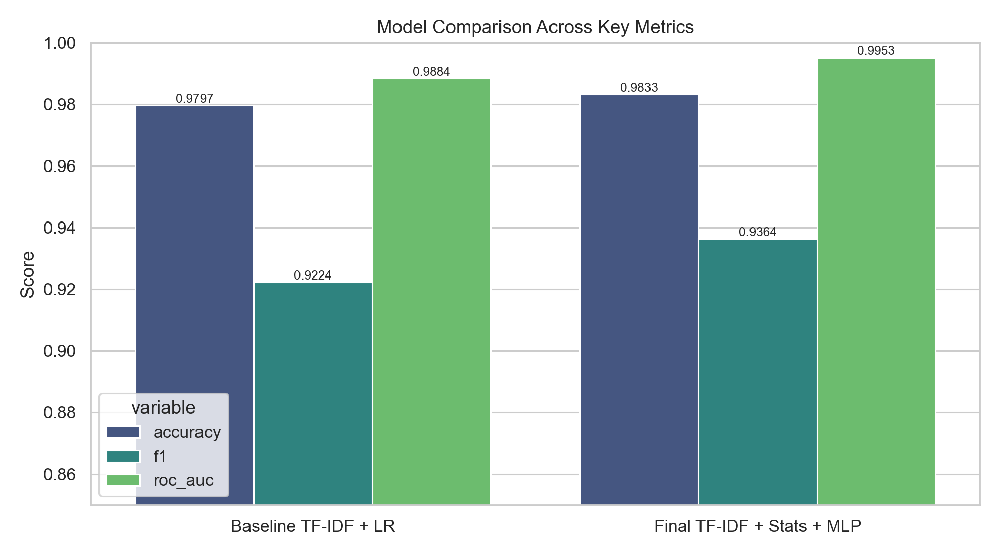

# Advanced Spam Email / SMS Detection

A notebook-driven machine learning project for classifying spam messages using a progression of text representations: **TF-IDF**, **handcrafted signals**, **BERT embeddings**, and **XGBoost**. The project also explores **probability calibration**, **threshold tuning**, **SHAP-based interpretation**, and a creative **graph-inspired feature** extension.

[Open the Colab notebook](https://colab.research.google.com/drive/1PKJwAwZ50F5eHQ_Dw-dc7CqMyFmJ_XWa?usp=sharing)

## Overview

This repository now contains two complementary tracks:

- the original exploratory notebook for storytelling and experimentation
- a cleaner **final-year-project training pipeline** in `final_year_spam_pipeline.py` for reproducible training, epoch-wise analysis, saved artifacts, and richer evaluation visuals

The notebook is still useful for learning, while the script makes the project feel more like a polished academic submission.

The project uses the public SMS Spam Collection dataset and compares multiple stages of feature engineering:

- Baseline TF-IDF + Logistic Regression
- TF-IDF + handcrafted numeric features
- TF-IDF + BERT embeddings + XGBoost
- Probability-calibrated spam scoring
- Graph-augmented feature experiment

## Key Highlights

- Uses a public dataset with **5,572 messages**
- Original notebook compares TF-IDF, handcrafted features, BERT embeddings, and graph-inspired features
- New pipeline adds a **train / validation / test split** for cleaner model selection
- New pipeline introduces **epoch-wise MLP training** with best-epoch tracking and threshold tuning
- Generates publication-style visuals such as training curves, ROC/PR curves, threshold analysis, confusion matrix, and model comparison
- Saves reusable training artifacts and metrics with `joblib` and JSON

## Workflow

1. Load and inspect the dataset
2. Create simple exploratory visuals
3. Train a baseline TF-IDF model
4. Add handcrafted signals like message length, `!`, and `$`
5. Extract BERT embeddings from `bert-base-uncased`
6. Train a hybrid XGBoost classifier
7. Calibrate probabilities for better confidence scores
8. Review mistakes and interpret predictions with SHAP
9. Add graph-inspired text structure features as an extra experiment

## Final-Year Project Upgrade

The new script-based pipeline in `final_year_spam_pipeline.py` upgrades the repository from a notebook demo to a more submission-ready ML project:

- uses a reproducible local dataset cache in `data/sms.tsv`
- creates richer handcrafted text signals such as lexical diversity, uppercase ratio, digit ratio, and punctuation-based cues
- builds a stronger TF-IDF baseline with bi-grams and balanced Logistic Regression
- reduces sparse text features with **TruncatedSVD**
- trains an **MLP classifier epoch by epoch**, then automatically picks the best epoch using validation F1
- selects a better operating threshold from the validation set instead of relying on a weak default cutoff
- exports figures, metrics, model artifacts, and misclassified examples for analysis

## Enhanced Pipeline Results

The upgraded final-year pipeline produced the following held-out test metrics:

| Model | Accuracy | F1 | ROC-AUC |
| --- | --- | --- | --- |
| TF-IDF + Logistic Regression baseline | **97.97%** | **0.9224** | **0.9884** |
| TF-IDF + statistical features + epoch-trained MLP | **98.33%** | **0.9364** | **0.9953** |

Best training configuration found by the new pipeline:

- Best epoch: **3**
- Chosen validation threshold: **0.2871**
- Best validation F1: **0.9737**

## Tech Stack

- Python
- pandas, numpy
- matplotlib, seaborn
- scikit-learn
- xgboost
- transformers
- torch
- shap
- joblib

## Reported Results

The notebook reports the following milestone results on the held-out test set:

| Model Stage | Result |
| --- | --- |
| TF-IDF + Logistic Regression | **97.58% accuracy** |
| TF-IDF + handcrafted features | **97.04% accuracy** |
| TF-IDF + BERT + XGBoost | **0.99 accuracy in report**, **ROC-AUC = 0.9967** |
| Graph-augmented hybrid model | **98.83% accuracy** |

Other useful observations captured in the notebook:

- Suggested high-precision threshold: **0.0008**
- Misclassified test samples shown for error analysis: **13**
- Best grid-search parameters: `max_depth=4`, `n_estimators=100`

## Output Gallery

### Dataset and Feature Exploration


### Model Evaluation




### Final Comparison and Interpretation




## Final-Year Output Gallery

### Training and Evaluation





### Final Model Outputs




## Project Files

```text
advance_spam_email/
|-- advance_spam_detection_BTP.ipynb
|-- final_year_spam_pipeline.py
|-- requirements.txt
|-- readme.md
|-- spam_model_v2.pkl
|-- spam_model_calibrated.pkl
|-- tfidf.pkl
|-- data/
|   `-- sms.tsv
|-- artifacts/
|   |-- final_year_metrics.json
|   `-- final_year_spam_model.joblib
`-- assets/
    |-- final_year_output/
    |   |-- class_distribution_final.png
    |   |-- message_length_distribution_final.png
    |   |-- feature_correlation_final.png
    |   |-- training_curves.png
    |   |-- roc_pr_curves.png
    |   |-- threshold_analysis.png
    |   |-- final_confusion_matrix.png
    |   |-- model_comparison.png
    |   `-- misclassified_examples.csv
    `-- output/
        |-- class_distribution.png
        |-- message_length_distribution.png
        |-- feature_correlation.png
        |-- baseline_confusion_matrix.png
        |-- baseline_vs_handcrafted.png
        |-- hybrid_confusion_matrix.png
        |-- precision_recall_curve.png
        |-- shap_summary.png
        `-- final_model_comparison.png
```

## Running the Notebook

1. Open `advance_spam_detection_BTP.ipynb` locally or in Colab.
2. Install the required packages from the notebook setup cell.
3. Run the cells in order.
4. The notebook downloads the SMS dataset automatically.
5. BERT weights are pulled from Hugging Face during execution.

Example install command used in the notebook:

```bash
pip install scikit-learn pandas numpy matplotlib seaborn scipy joblib transformers torch xgboost shap
```

## Running the Final-Year Pipeline

1. Install dependencies from `requirements.txt`
2. Run the script:

```bash
python final_year_spam_pipeline.py
```

The script will:

- download and cache the dataset in `data/sms.tsv` if it is not already present
- train the improved baseline and epoch-based neural model
- generate graphs in `assets/final_year_output/`
- save metrics and the final artifact bundle in `artifacts/`

## Running the Web Demo

A simple HTML interface is included so you can type a message and get a `ham` or `spam` prediction from the saved model.

Files:

- `app.py`
- `templates/index.html`
- `static/styles.css`

Run:

```bash
python app.py
```

Then open:

```text
http://127.0.0.1:5000
```

## Saved Artifacts

- `tfidf.pkl` - trained TF-IDF vectorizer
- `spam_model_v2.pkl` - hybrid XGBoost classifier
- `spam_model_calibrated.pkl` - calibrated classifier for better probability estimates

## Important Note

The notebook's `predict_spam(...)` helper expects saved `bert_model/` and `bert_tokenizer/` directories. Those folders are referenced in the notebook but are **not currently present in this repository**, so you should rerun the save cells before using the helper exactly as written.

## Future Improvements

- Commit the saved BERT tokenizer/model folders or switch inference to download them automatically
- Package inference into a small API or Streamlit app
- Add k-fold cross-validation reporting and feature importance summaries
- Compare the MLP pipeline against a fine-tuned transformer when compute is available

## Authoring Note

This repository is strongest as a **learning + experimentation notebook** that shows how a spam classifier can evolve from a classical NLP baseline into a richer hybrid ML pipeline.
